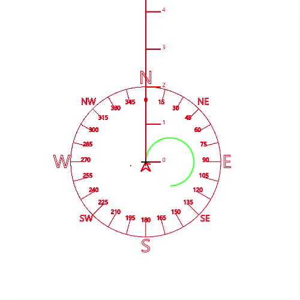
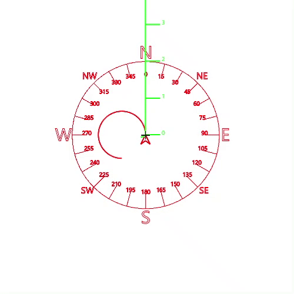
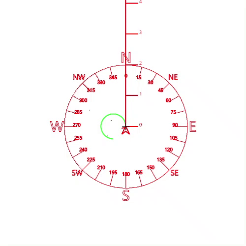
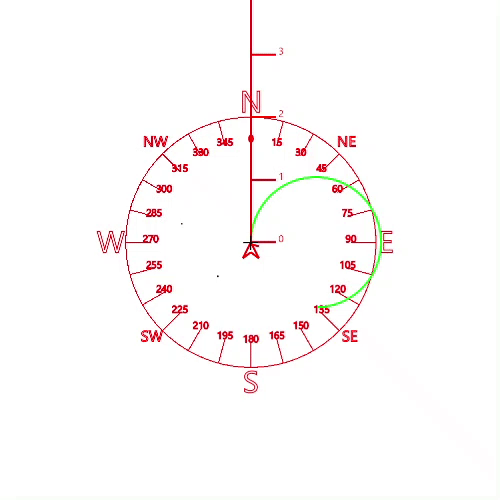
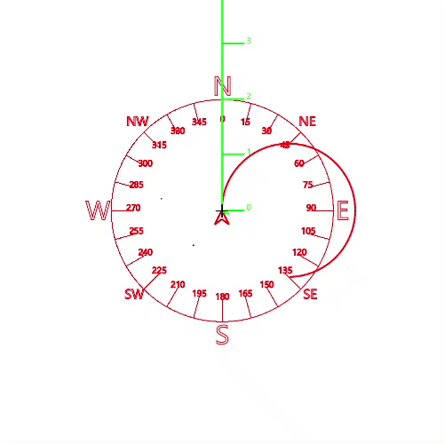
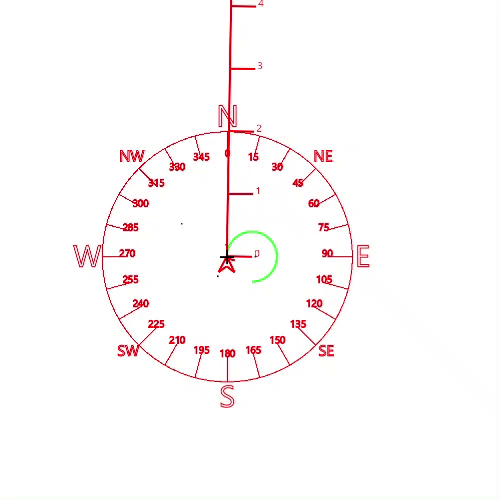
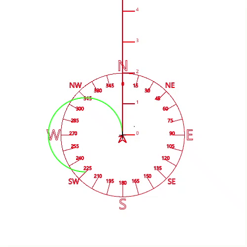

This code replaces a tablet and stylus, or a paper and pencil, with voice commands.  Using these voice commands, you can draw without using your hands.  

# Demo Video

# Installation

To install this software, 

1. Install Talon on your operating system.
2. Install a copy of the [knausj-talon repository.](https://github.com/knausj85/knausj_talon )
3. Download and install this repository by putting it in the user directory of your Talon installation.  

This mouse is not a stand-alone file: since several of the commands use numbers, you need a repository that has implemented numbers as voice commands.  The knausj repository is such a repository. 

The mouse is designed with the idea that you can draw if you can steer a mouse around like a car or a ship.  

# Starting the Mouse

This mouse is designed as to operate in it's own special mode- when drawing mode is on, it turns off all other commands and only permits the commands used for drawing.  

Starting the mouse has two stages.  First, you have to activate drawing mode.  Then, you have to turn on the mouse. 

To turn on drawing mode, say 

    drawing mode

To turn off drawing mode, say

    drawing mode off

Switching to command mode will NOT turn off drawing mode.  You have to say 'drawing mode off' to turn it off.  

Once you are in drawing mode, to turn on the mouse, say 

    start your engine

To turn off the mouse, say 

    park the car

These commands come from the idea that the mouse is steered around the screen like you would steer a car.  

The mouse will turn itself off after 45 seconds of receiving no commands.  This is because it is possible to start the car and set it in motion, and if voice commands no longer work (if, for example, you unplug your headphones from your computer and the microphone does not automatically switch).  The mouse can get in a state where it is dragging your mouse pointer around the screen- but with the 45 second limit that will only last a maximum of 45 seconds.  

# Basic drawing commands  

The simplest way to get started drawing is by using directions commands and hissing.  

You will notice that the helper graphic has a straight line and a curve.  One of those will be green.  If you start hissing, the car will move forward along the line that is green.  When you stop hissing, it will stop.  

## Going straight

To select the straight line for the car to drive alng, say 

    'straight' 

# Turning Left

To select the curve to the left for the car to drive along, say 

    'left'

# Turning Right

To select the curve to the right for the car to drive along, say 

    'right' 

# Making the Curve Gentler/Looser

increase the radius of the curve, say 

    'radius up <number>'

For example, 'radius up 10' will increase the size of the curve circle by 10 

# Making the Curve Sharper/Tighter

To decrease the radius of the curve, say 

    'radius down <number>'

For example 'radius down 5'

# Making A Corner

To change the orientation of the mouse without drawing a curve, say a number between one and 360.  This will point the straight ruler to that degree on the compass rose.  This is how to make corners.  

To actually draw, you must open up a drawing program, select a drawing tool and start a drag command.  This is the equivalent to putting down a stylus on a tablet or holding down the mouse button on a mouse or trackpad.  

Say 

    'drag' 

To start dragging and put your virtual 'pen' down on your virtual 'paper'

Say 

    'drag end' 

to finish dragging and lift your virtual 'pen' off your virtual 'paper'.

Using hissing and these 5 drawing commands, you can draw!  

# Advanced Drawing Commands 

If you want more precision when drawing, and don't want to hiss, you can be more specific in the following ways:  

# Drawing A Specified Distance

The following commands are currently imprecise, and will change later.  

The straight ruler has tick marks on it.  You can draw to a specific tick mark such as two by saying

    'drive two'

You can draw to partial points on the line by saying a decimal, such as 

    'drive one point two five'  

To drive less than one tick mark, you must say the leading zero, such as

    'drive zero point two'

## Drawing A Specified Distance Along A curve

To drive along the curve of your turning circle, specify the number of degrees you want to drive.  For example, if you want to drive a fourth of the way around your turning circle, say 

    'turn nintey'  

As of right now, the curve command is not quite precise.  You can go 360 degrees (or more) but you can't do fractions of a degree.  

The car mode will turn itself off automatically after 45 seconds of no commands / input.
